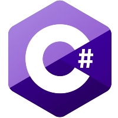

# Hi there 👋, my name is Sebastian
### I am a web developer

> My skills are:
> 
> **JS** / **Java** / C# / HTML / CSS

- 🌱 I’m currently learning React.js

    <picture>
        
    </picture>
    <picture>
        
    </picture>
    <picture>
        
    </picture>
    <picture>
        <source media="(prefers-color-scheme: dark)" srcset="HTML-Dark.png">
        <source media="(prefers-color-scheme: light)" srcset="HTML-Light.png">
        
    </picture>
    <picture>
        <source media="(prefers-color-scheme: dark)" srcset="CSS-Dark.png">
        <source media="(prefers-color-scheme: light)" srcset="CSS-Light.png">
            
    </picture>
    <picture>
       <source media="(prefers-color-scheme: dark)" srcset="BASH-Dark.png">
       <source media="(prefers-color-scheme: light)" srcset="BASH-Light.png">
         

